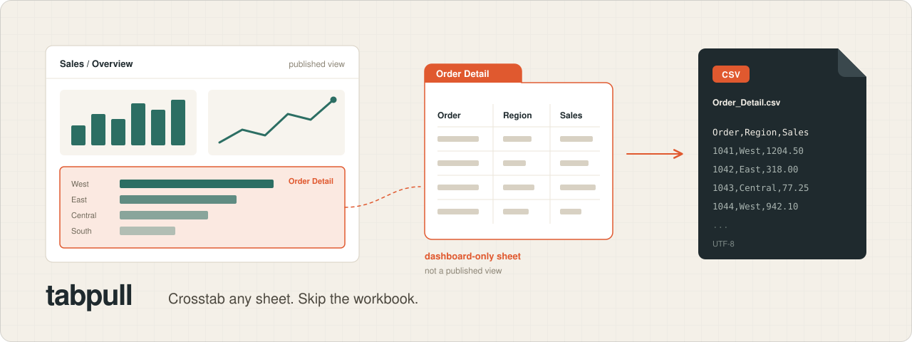

<p align="center">
  
</p>

<p align="center">
  <a href="LICENSE"></a>
  <a href="pyproject.toml"></a>
</p>

<p align="center">
  <strong>Crosstab any sheet. Skip the workbook.</strong><br />
  Dashboard-only sheets included. Embedding API with your SSO session; a PAT finds the views.
</p>

<p align="center">
  <a href="#why">Why</a> ·
  <a href="#install">Install</a> ·
  <a href="#setup">Setup</a> ·
  <a href="#use">Use</a> ·
  <a href="#where-files-live">Where files live</a> ·
  <a href="#jobs-file">Jobs</a> ·
  <a href="#develop">Develop</a>
</p>

---

## Why

The REST crosstab/data endpoints only export the first sheet when the view is a dashboard, and a worksheet that lives only inside a published dashboard (often called a hidden sheet) is not published as its own view, so it has no REST view at all.

tabpull does the hand path from the command line: open the dashboard, set filters, then Download → Crosstab → CSV. That includes dashboard-only sheets and ones that aren't first alphabetically, and it works on sites where you're allowed to crosstab but not to download the workbook.

Dashboard sheets go through the Tableau Embedding API (`exportCrosstabAsync`) in a headless browser signed in with your SSO session. The PAT is still used to find views.

## Install

From a checkout of this repo:

```sh
uv tool install .
```

That installs one `tabpull` command. `setup`, `add`, `run`, and `login` are subcommands. From a checkout, `uv run tabpull` is the same command.

## Setup

```sh
tabpull setup
tabpull setup --site finance   # local name jobs will use
```

The wizard asks for that name (unless you passed `--site`), a dashboard URL, and a personal access token. It checks the token, then opens a browser for your normal SSO sign-in.

Run it again for another Tableau server or site. Each site keeps its own token and browser session. Re-running a name keeps the current values when you press Enter.

The browser is your installed Chrome, then Edge. If neither is installed, run `uv run playwright install chromium`. tabpull does not download a browser while Chrome or Edge is already there.

## Use

```sh
tabpull add                         # prompts: search a view or paste its URL, pick sheets and filters
tabpull add --site finance \
  --view SalesWorkbook/Overview \
  --sheet "Order Detail" --sheet Totals \
  --filter "Region=West|Central" \
  --filter "Order Date=2026-09-01..2026-09-25 @Totals" \
  --param "Top N=25" \
  --name daily-west                 # same result, no prompts
tabpull run                         # export every job
tabpull run daily-west              # only some jobs
tabpull login                       # refresh SSO for the only site
tabpull login --site finance        # refresh one site when several are configured
```

`add` saves the job and prints the `run` command. It does not export. With `--view` and at least one `--sheet`, `add` writes the job and does not prompt. Leave those flags off and it asks.

Flag `add` still opens the view far enough to refuse a story, with the same message as interactive add: `Stories are not supported; use the dashboard inside it.` `run` refuses a story the same way, before it exports.

`--filter` is `Field=a|b` or `Field=min..max`, and ` @Sheet` names the worksheet. A filter with no sheet is applied on the first sheet in the job, and tabpull prints that. With one configured site, `--site` can be omitted. With several, pass `--site` or pick one at the prompt.

`run` keeps going when one job fails and exits non-zero if any did. Each job uses the site it names. When that site's SSO session is missing or expired, tabpull opens the sign-in window if you're at a terminal, and otherwise exits and tells you to run `tabpull login --site <name>`. Crosstab CSVs are rewritten from Tableau's UTF-16 tab-separated format to plain UTF-8 CSV.

Point one run at another jobs file or output folder:

```sh
tabpull --jobs ./jobs.toml --out ./exports run daily-west
```

## Where files live

Tokens, cookies, jobs, and exports stay in the config and data directories. They stay put when you change the working directory. Deleting those two directories removes tabpull's files from the machine. A `.env` file and `TABLEAU_*` environment variables are not read.

| | Linux | macOS | Windows |
| --- | --- | --- | --- |
| Config (site tokens, `jobs.toml`) | `$XDG_CONFIG_HOME/tabpull` or `~/.config/tabpull` | `~/Library/Application Support/tabpull` | `%APPDATA%\tabpull` |
| Data (SSO cookies, `exports/`) | `$XDG_DATA_HOME/tabpull` or `~/.local/share/tabpull` | `~/Library/Application Support/tabpull` | `%LOCALAPPDATA%\tabpull` |

`XDG_CONFIG_HOME` and `XDG_DATA_HOME` win on every OS when they are set.

```text
<config>/tabpull/sites/<name>.env     server, Tableau site, token name, token secret
<config>/tabpull/jobs.toml
<data>/tabpull/auth/<name>.json       SSO cookies; mode 600
<data>/tabpull/exports/<job>/<sheet>.csv
```

The token secret is not printed. Setup and login print the server and the Tableau site.

## Jobs file

`add` writes these for you, and you can also edit the jobs file by hand:

```toml
[[job]]
name = "daily-west"
site = "finance"                       # local name from `tabpull setup`
view = "SalesWorkbook/Overview"        # Workbook/View from the URL
sheets = ["Order Detail", "Totals"]    # any worksheet in the dashboard, dashboard-only ones included
filters = [
  { field = "Region", values = ["West", "Central"] },
  { field = "Order Date", min = "2026-09-01", max = "2026-09-25", sheet = "Totals" },
]
params = { "Top N" = "25" }
```

Parameters are set first, then filters, in the same order you'd set them in the dashboard. A filter applies on `sheet`. When `sheet` is omitted, tabpull applies that filter on the first entry in `sheets` and prints a line saying so. It does not copy the filter onto every sheet. Other sheets change only the way that same filter changes them in the dashboard.

Dates written as `YYYY-MM-DD` or `M/D/YYYY`, and plain numbers, are converted for range filters. An impossible date such as `2024-02-31` or `2/31/2024` is rejected. A relative date (`yesterday`, `last week`, `today`, `7 days ago`) or a date computed at run time is refused. Use a parameter, or write an absolute `YYYY-MM-DD` or `M/D/YYYY` date.

Stories are refused; use the dashboard inside the story.

## Develop

```sh
uv run ruff check && uv run ruff format && uv run ty check && uv run pytest
```
